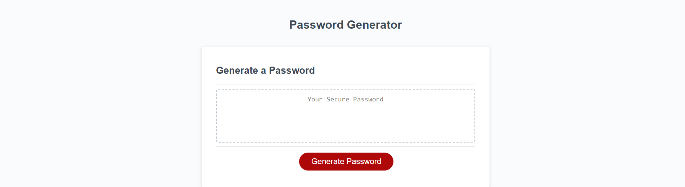

#  password-generator

## Description

A random password was needing to be generated for security purposed. The need came at a press of a button. A password with a length between 8-128 characters will be generated randomly at the press of a button. I have learned how to incoporate logical thinking within a function to produce a random value.

## Installation

Visit the website at this url:
Visit the GitHub Repo at this url:

## Usage

Hit the red buttom. Fill out the forms to your desires. 

## Credits

I watched a YouTube video by William Horn who provided some logical clues on how to find a random value in a function. 

## Features

The website features a button which generates a random code of characters at a user selected length and variety. 

